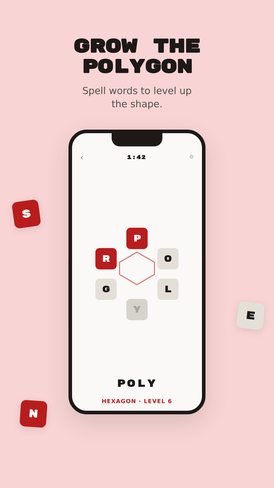
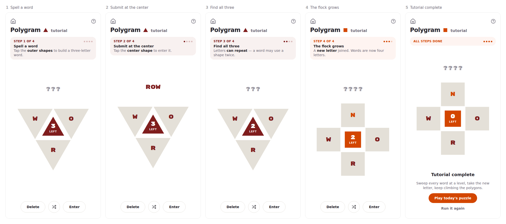
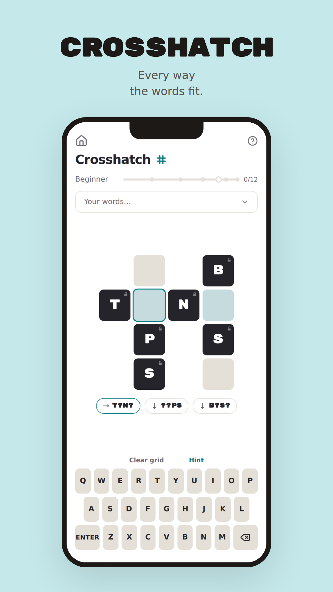
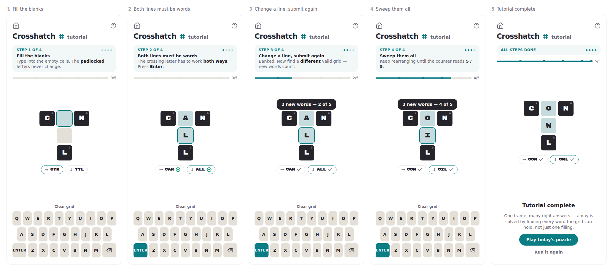
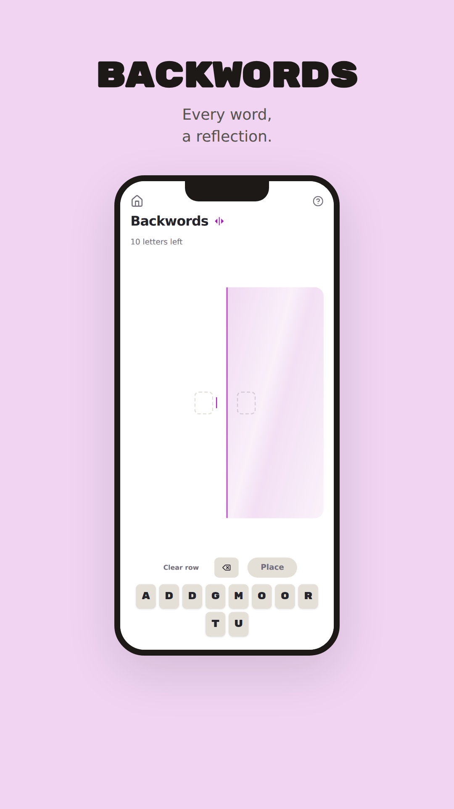
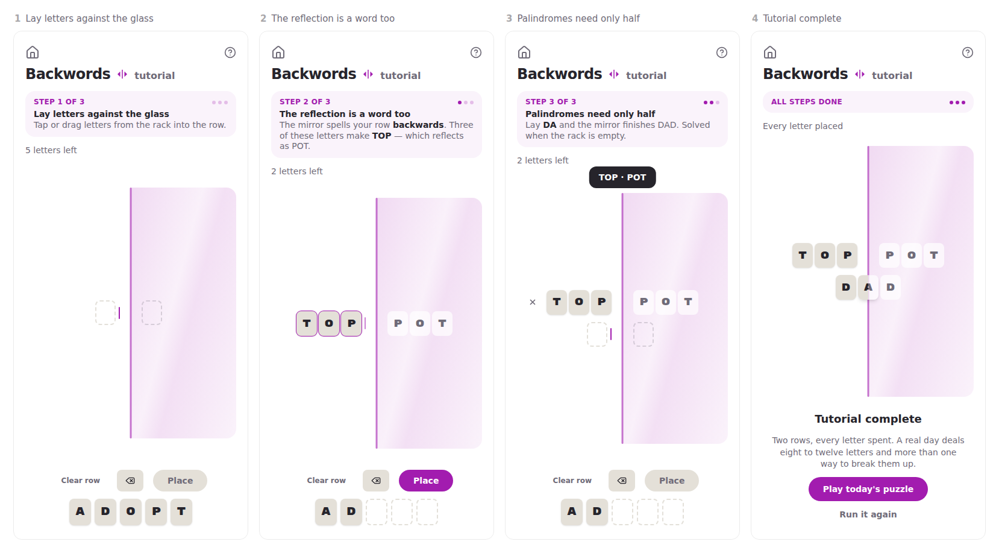
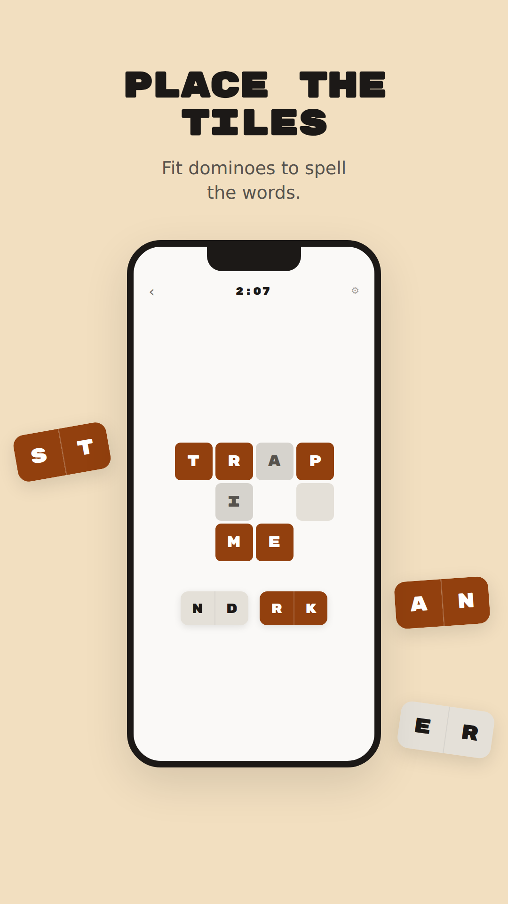
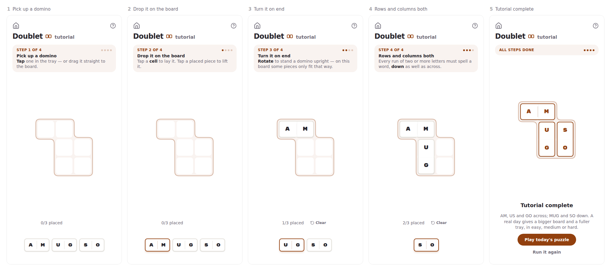
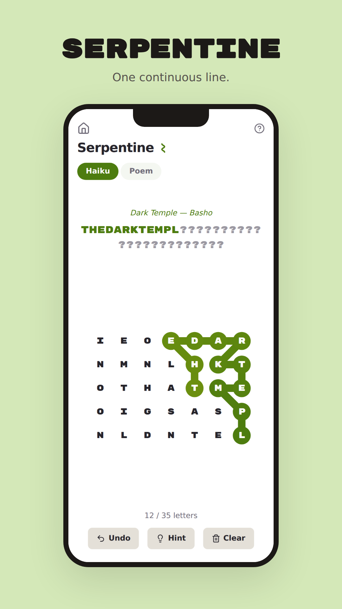
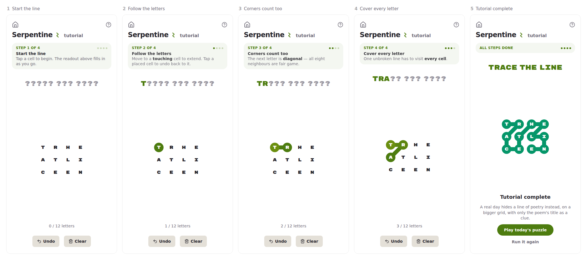

# WordGirl

A little collection of games, made with love. Mobile-first, offline-capable
PWA — install it on a phone and play anywhere.

Every game has a **tutorial**: one hand-picked miniature puzzle, walked
a step at a time, introducing the rules in the order they stop being
guessable. It is offered once on your first visit to a game, and stays on
the hub as each game's **Tutorial** tile — nothing about it is scored,
timed or saved.
The strips below step through each one; **[docs/tutorials.md](docs/tutorials.md)**
has them full size, with a note on why each puzzle is the one it is.

## Games

### Polygram

<p align="center">
  
</p>

Inspired by NYT Spelling Bee, with escalating polygon levels:

- Start with **3 letters in triangles** flocking around a central triangle.
- Tap the outer shapes to build a word; tap the **central shape** to submit.
- At level N, valid words are **exactly N letters long**, built from the N
  available letters — **letters can repeat** (with A,B,C, "ABA" counts).
- Find **all** the words at a level and a new letter joins the flock: the
  shapes morph into the next polygon (triangle → square → pentagon → …).
- The puzzle ends at the last polygon that still has a valid word — if no
  10-letter word exists, the decagon never appears.
- The word list shows blanks for unfound words **in alphabetical order**
  — where a blank sits between found words is itself a gentle hint. (A
  letter-reveal hint system exists in the engine but is hidden for now.)
- No score: a day's result is the words found out of every word the
  puzzle held, required and bonus.
- One **daily puzzle** (same for everyone, deterministic from the date)
  plus unlimited **practice** puzzles.


<a href="docs/tutorials.md#polygram">
  <picture>
    <source media="(prefers-color-scheme: dark)" srcset="docs/tutorials/polygram-strip-dark.png">
    
  </picture>
</a>

<sub><b>Tutorial</b> — 4 steps, one small puzzle. Click through for full size.</sub>

### Crosshatch

<p align="center">
  
</p>

A small crossword frame with many right answers:

- **Two boards a day**, and the day counts when both are solved:
  **Normal** (3–5 lines of 3–5 letters) and **Hard** (4–5 lines, every
  one of them five letters, on denser skeletons). Same-sized word list,
  less of each line showing — 43% given against Normal's 52%, so the
  words are harder to find rather than more numerous.
- **3–5 intersecting lines**, each locked to a few given letters. Type
  freely into the rest.
- Fill every line with a valid word (crossings agree, no repeats) and
  submit — every **new word** in a valid grid counts. Change lines and
  keep hunting.
- The daily generator enumerates **every** valid filling and accepts
  days with 10–22 distinct words (no single line hoarding more than 8),
  per board.
- **Every word solves the board** — the ~90% threshold went in #67, and
  a board is not done until its list is empty.
- Chips under the grid judge each line's current word: ❌ doesn't work
  there, grey ✓ counted already, ✅ a new word.
- The words panel lists the whole day as **?-blanks** (like Polygram);
  blanks are tappable to aim **hints**, which reveal letters from the
  left —
  the first daily hint warns that the share text will carry a 🫣 count.
- Daily + practice + a replayable archive, same as Polygram.


<a href="docs/tutorials.md#crosshatch">
  <picture>
    <source media="(prefers-color-scheme: dark)" srcset="docs/tutorials/crosshatch-strip-dark.png">
    
  </picture>
</a>

<sub><b>Tutorial</b> — 4 steps, one small puzzle. Click through for full size.</sub>

### Backwords

<p align="center">
  
</p>

A race against a hidden clock, played into a mirror:

- Each day deals a **bank of 8–12 letters** and one rule: lay words
  against the central mirror so the **reflection reads as a word too**
  (pots|stop) — palindromes straddle the glass, completed by the
  mirror from just their first half.
- **Use every letter** to solve the board. Rows stay editable (tap ×
  to take one back) until the last letter lands.
- Every day states its **par** — the fewest rows it can possibly be
  solved in, computed exactly, so it is always reachable and never
  beatable. Short pairs clear the rack; the long word hiding in it
  (STRAW|WARTS, DIAPER|REPAID) clears it at par.
- The **timer runs silently** and is revealed at the end — the share
  line is your rows against par, and your time.
- Rows a real mirror would render (LIT reflects as TIL) earn a **✦**.
- Daily + practice + a replayable archive, same as the others.


<a href="docs/tutorials.md#backwords">
  <picture>
    <source media="(prefers-color-scheme: dark)" srcset="docs/tutorials/backwords-strip-dark.png">
    
  </picture>
</a>

<sub><b>Tutorial</b> — 3 steps, one small puzzle. Click through for full size.</sub>

### Doublet

<p align="center">
  
</p>

A domino-placement word puzzle:

- Each day deals a set of **letter dominoes** (two-letter tiles) and a
  small crossword-style board.
- **Place every domino** onto the board so that each row and column of
  letters spells a **valid word**.
- **Tap** a domino to select it, then tap a cell to place it — or
  **drag** dominoes directly. Tap a placed domino to pick it back up.
- **Rotate** dominoes to change orientation before placing them.
- Three difficulty tiers: **Easy**, **Medium**, **Hard**.
- Daily + practice + a replayable archive, same as the others.


<a href="docs/tutorials.md#doublet">
  <picture>
    <source media="(prefers-color-scheme: dark)" srcset="docs/tutorials/doublet-strip-dark.png">
    
  </picture>
</a>

<sub><b>Tutorial</b> — 4 steps, one small puzzle. Click through for full size.</sub>

### Serpentine

<p align="center">
  
</p>

A path-tracing puzzle that uncovers hidden poetry:

- A grid of letters hides a **single continuous path** — trace it by
  moving through adjacent cells (horizontally, vertically, or
  **diagonally**).
- The path **never crosses itself** — two diagonals never make an X, so
  the line reads the way a snake does.
- The path must **cover every letter** in the grid.
- The letters along the path spell a **hidden phrase** — the puzzle
  title is your only clue.
- **Tap** a cell to extend the path, or **drag** through cells. Tap a
  placed cell to undo back to it.
- Two modes: **Haiku** and **Poem**.
- Daily + practice + a replayable archive, same as the others.


<a href="docs/tutorials.md#serpentine">
  <picture>
    <source media="(prefers-color-scheme: dark)" srcset="docs/tutorials/serpentine-strip-dark.png">
    
  </picture>
</a>

<sub><b>Tutorial</b> — 4 steps, one small puzzle. Click through for full size.</sub>

## Development

```bash
npm install
npm run dev        # dev server
npm test           # vitest suite (engine, generator, storage, reducer)
npm run build      # typecheck + production build + service worker
npm run preview    # serve the production build locally
```

### Architecture

- **Single Vite app** — React + TypeScript + Tailwind v4. Each game is a
  folder under `src/games/<id>/` and a one-line entry in
  `src/games/registry.ts`; routes and hub cards are generated from the
  registry, and each game is a lazy code-split chunk.
- **Game engines are pure TS** (`src/games/polygram/engine/`) — no React,
  no DOM — so they're unit-testable and portable (Capacitor later).
- **Display settings** (theme, text size, font) are applied by mutating
  `<html>` — `data-theme` flips `color-scheme` so the `light-dark()`
  tokens resolve the other way, text size scales the root font-size, and
  `data-font="accessible"` re-points the two font tokens at Lexend. One
  mechanism each, no duplicated token blocks. The Accessible face is
  precached, so it works offline the first time it is chosen; spans whose
  content swaps between a letter and a `?` carry `data-glyph`, which pins
  one advance width apiece in that face (Lexend is proportional; the house
  game face is monospaced).
- **Storage** goes through an async `StorageAdapter`
  (`src/lib/storage/`), localStorage-backed today. The `profileId`
  namespace segment is the seam for adding auth/cloud sync later without
  touching game code.
- **Daily puzzles** are generated client-side from a seeded PRNG
  (`polygram:v1:daily:<local date>`), so everyone gets the same puzzle
  with zero backend. Determinism depends on the committed dictionary —
  regenerating `dictionary.txt` (`npm run build:dictionary`) changes
  future dailies; bump `DICT_VERSION` in `engine/dictionary.ts` if you do.
- **Two-tier dictionary** — `dictionary.txt` holds *required* words
  (common: top-12k by frequency) plus *bonus* words (rarer: 12k–30k,
  prefixed with `+`). Required words gate level clears and receive
  hints; bonus words are optional finds. Saves from an older
  `DICT_VERSION` are kept as historical archive records, and that day
  restarts fresh when replayed.

### PWA / iOS

- Installed via Safari: **Share → Add to Home Screen** (iOS has no
  install prompt).
- Fully offline after first load — the service worker precaches the app
  and dictionary.
- Note: iOS may evict localStorage for PWAs unused for weeks; cloud sync
  is the eventual fix (seam already in place).

### Deploying

Pushes to `main` deploy via Netlify (`netlify.toml`: build `npm run
build`, publish `dist/`, SPA redirect included).
