# Tutorials

Every game ships a tutorial: one hand-picked miniature puzzle, walked a step
at a time, introducing the rules in the order they stop being guessable.

A tutorial is offered once, on your first visit to a game, and lives behind
the header's "?" afterwards. Nothing about it is scored, timed, shared or
saved — no day record, no stats, no streak. Hints are switched off, and the
day-scale chrome (rank titles, the browse-the-day word panels) is hidden,
because neither means anything on a five-word puzzle.

Every screenshot on this page is the real thing, captured from a production
build at 390×844. Light and dark are both included and follow your GitHub
theme. Step captions are read from the running banner, so they cannot drift
from the shipped copy.

## Polygram ▲

**The puzzle:** letters **O R W**, then **N** — 4 steps.

<picture>
  <source media="(prefers-color-scheme: dark)" srcset="tutorials/polygram-strip-dark.png">
  
</picture>

The triangle holds exactly three words — ROW, WOO and WOW — and two of
them reuse a shape, which is the rule players most often assume is illegal.
Clearing it joins N for a two-word square (NOON, WORN) and stops there. The
word lists are asserted *exhaustive* against the shipped dictionary, so a word
you can legitimately spell is never rejected.

| Step | |
| --: | :-- |
| 1 | Spell a word |
| 2 | Submit at the center |
| 3 | Find all three |
| 4 | The flock grows |

Full-size frames

**1 · Spell a word**

<picture>
  <source media="(prefers-color-scheme: dark)" srcset="tutorials/polygram-1-blank-board-dark.png">
  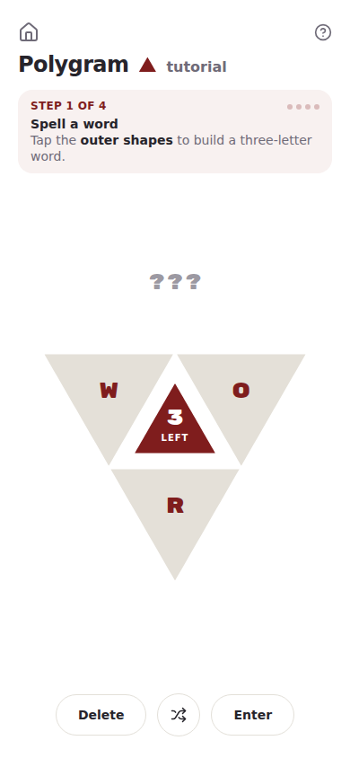
</picture>

**2 · Submit at the center**

<picture>
  <source media="(prefers-color-scheme: dark)" srcset="tutorials/polygram-2-word-built-dark.png">
  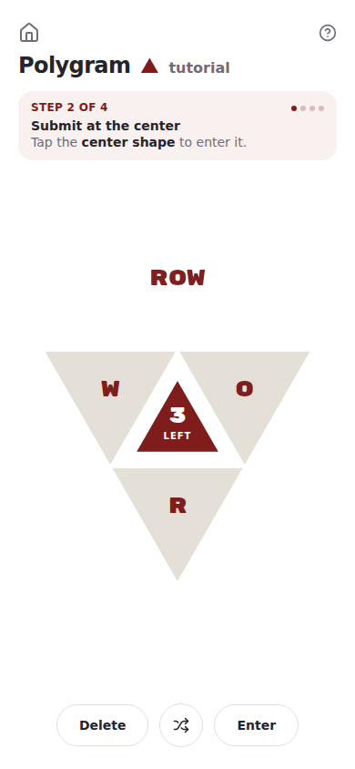
</picture>

**3 · Find all three**

<picture>
  <source media="(prefers-color-scheme: dark)" srcset="tutorials/polygram-3-first-word-dark.png">
  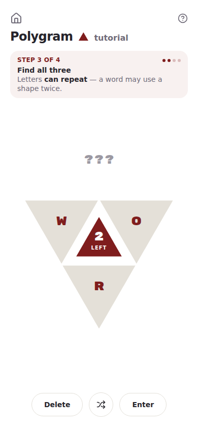
</picture>

**4 · The flock grows**

<picture>
  <source media="(prefers-color-scheme: dark)" srcset="tutorials/polygram-4-level-cleared-dark.png">
  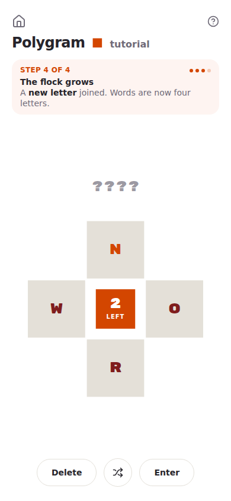
</picture>

**5 · Tutorial complete**

<picture>
  <source media="(prefers-color-scheme: dark)" srcset="tutorials/polygram-5-complete-dark.png">
  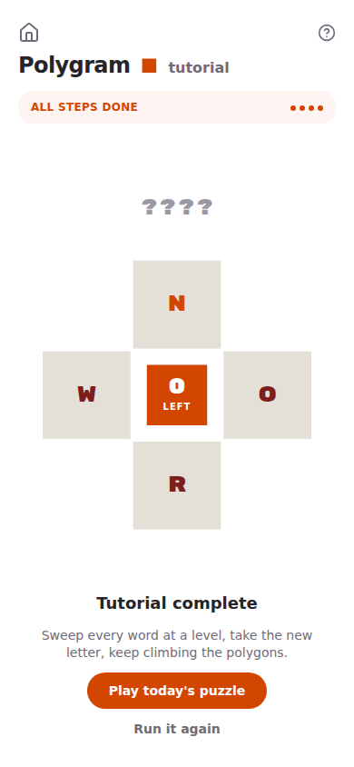
</picture>

## Crosshatch #

**The puzzle:** `C_N` crossing `__L` — 4 steps.

<picture>
  <source media="(prefers-color-scheme: dark)" srcset="tutorials/crosshatch-strip-dark.png">
  
</picture>

Three locked letters leave two cells to type, and the required tier fills
them exactly three ways: CAN/ALL, CON/OIL, CON/OWL. Five words, and no single
submission banks more than two — so sweeping the grid *requires* changing a line
and submitting again, which is the rule the daily never forces you to discover.

| Step | |
| --: | :-- |
| 1 | Fill the blanks |
| 2 | Both lines must be words |
| 3 | Change a line, submit again |
| 4 | Sweep them all |

Full-size frames

**1 · Fill the blanks**

<picture>
  <source media="(prefers-color-scheme: dark)" srcset="tutorials/crosshatch-1-blank-grid-dark.png">
  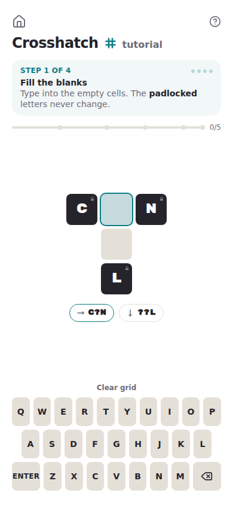
</picture>

**2 · Both lines must be words**

<picture>
  <source media="(prefers-color-scheme: dark)" srcset="tutorials/crosshatch-2-grid-filled-dark.png">
  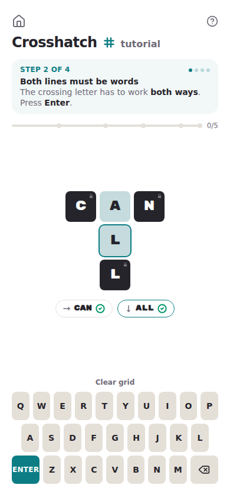
</picture>

**3 · Change a line, submit again**

<picture>
  <source media="(prefers-color-scheme: dark)" srcset="tutorials/crosshatch-3-first-submit-dark.png">
  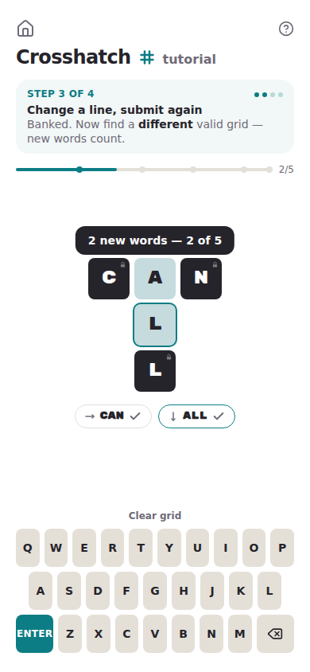
</picture>

**4 · Sweep them all**

<picture>
  <source media="(prefers-color-scheme: dark)" srcset="tutorials/crosshatch-4-second-submit-dark.png">
  
</picture>

**5 · Tutorial complete**

<picture>
  <source media="(prefers-color-scheme: dark)" srcset="tutorials/crosshatch-5-complete-dark.png">
  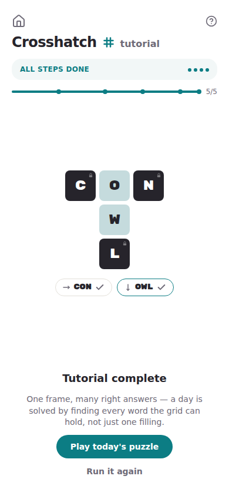
</picture>

## Backwords ◀▶

**The puzzle:** five letters that sort to **ADOPT** — 3 steps.

<picture>
  <source media="(prefers-color-scheme: dark)" srcset="tutorials/backwords-strip-dark.png">
  
</picture>

The bank decomposes exactly one way: TOP against the glass (which the
mirror reads back as POT), then DA, which the mirror finishes into DAD. The pair
can be laid from either side, so the first move is forgiving; the palindrome then
teaches the part nobody guesses — that you lay only its first half.

| Step | |
| --: | :-- |
| 1 | Lay letters against the glass |
| 2 | The reflection is a word too |
| 3 | Palindromes need only half |

Full-size frames

**1 · Lay letters against the glass**

<picture>
  <source media="(prefers-color-scheme: dark)" srcset="tutorials/backwords-1-blank-rack-dark.png">
  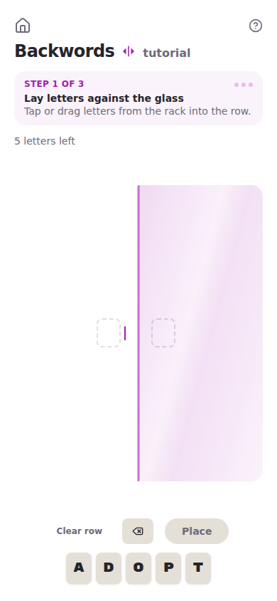
</picture>

**2 · The reflection is a word too**

<picture>
  <source media="(prefers-color-scheme: dark)" srcset="tutorials/backwords-2-word-staged-dark.png">
  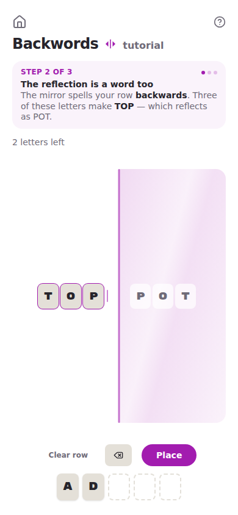
</picture>

**3 · Palindromes need only half**

<picture>
  <source media="(prefers-color-scheme: dark)" srcset="tutorials/backwords-3-pair-placed-dark.png">
  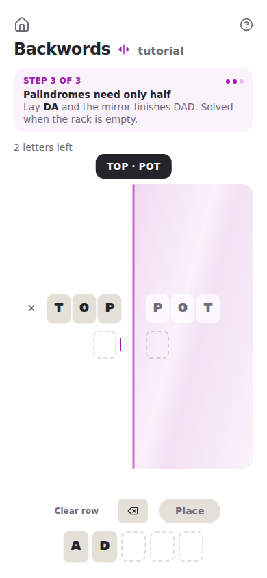
</picture>

**4 · Tutorial complete**

<picture>
  <source media="(prefers-color-scheme: dark)" srcset="tutorials/backwords-4-complete-dark.png">
  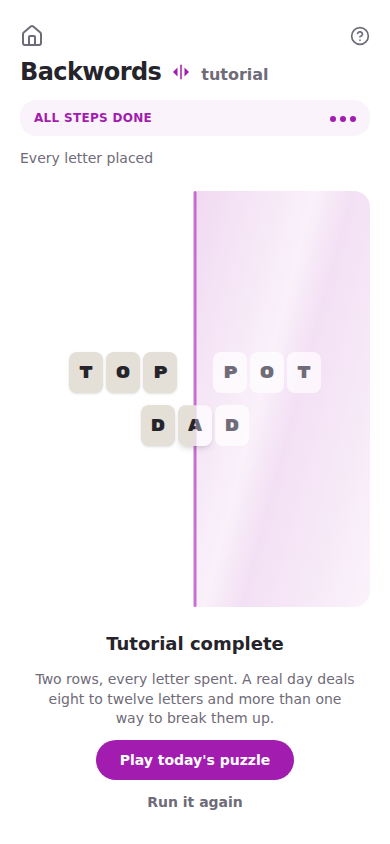
</picture>

## Doublet ▭▭

**The puzzle:** six cells, three dominoes — 4 steps.

<picture>
  <source media="(prefers-color-scheme: dark)" srcset="tutorials/doublet-strip-dark.png">
  
</picture>

Six is the smallest board that can *teach* rotation. On four cells the
same letter pairs tile both ways, so a player never has to turn a piece; this cut
has exactly one solution and reaching it means standing two dominoes on end.
AM, US and GO read across; MUG and SO read down.

| Step | |
| --: | :-- |
| 1 | Pick up a domino |
| 2 | Drop it on the board |
| 3 | Turn it on end |
| 4 | Rows and columns both |

Full-size frames

**1 · Pick up a domino**

<picture>
  <source media="(prefers-color-scheme: dark)" srcset="tutorials/doublet-1-blank-board-dark.png">
  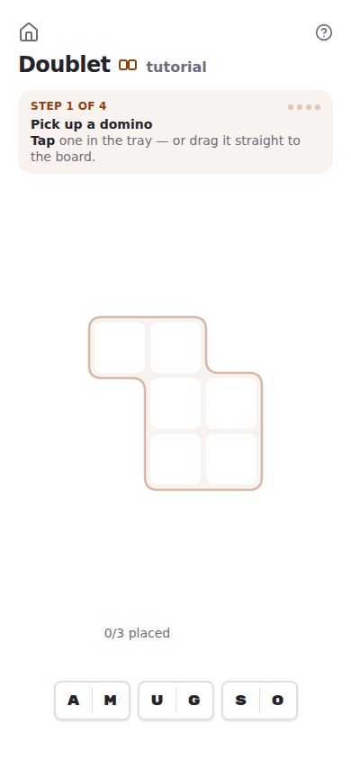
</picture>

**2 · Drop it on the board**

<picture>
  <source media="(prefers-color-scheme: dark)" srcset="tutorials/doublet-2-domino-picked-dark.png">
  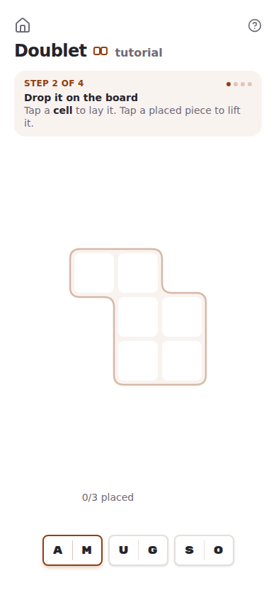
</picture>

**3 · Turn it on end**

<picture>
  <source media="(prefers-color-scheme: dark)" srcset="tutorials/doublet-3-domino-placed-dark.png">
  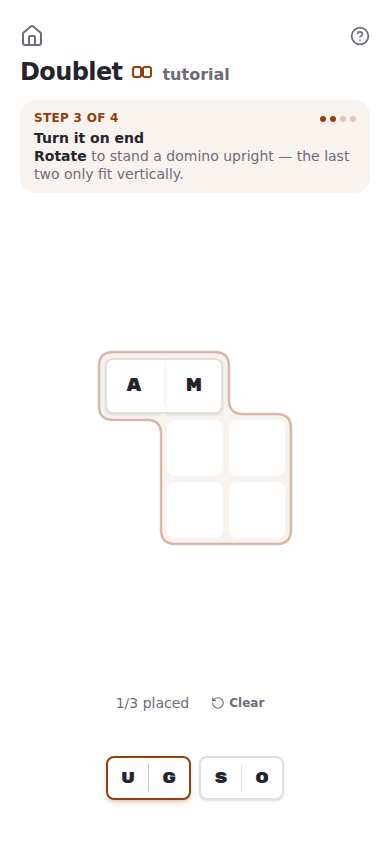
</picture>

**4 · Rows and columns both**

<picture>
  <source media="(prefers-color-scheme: dark)" srcset="tutorials/doublet-4-domino-rotated-dark.png">
  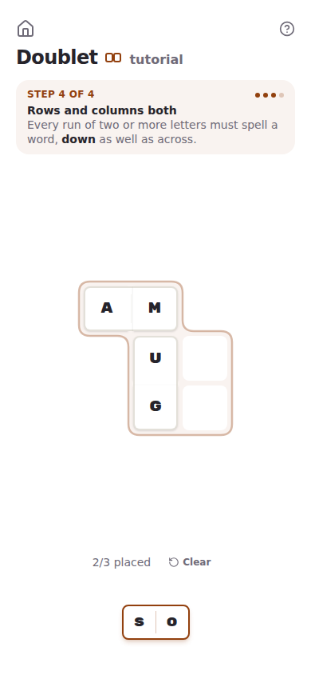
</picture>

**5 · Tutorial complete**

<picture>
  <source media="(prefers-color-scheme: dark)" srcset="tutorials/doublet-5-complete-dark.png">
  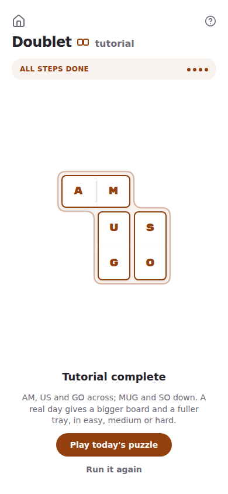
</picture>

## Serpentine ⟆

**The puzzle:** a 3×4 grid spelling **TRACE THE LINE** — 4 steps.

<picture>
  <source media="(prefers-color-scheme: dark)" srcset="tutorials/serpentine-strip-dark.png">
  
</picture>

The corpus can't supply this — its shortest line is 25 letters, and every
corpus layout is randomised per date, whereas a tutorial needs a fixed path the
steps can describe. Three of the moves are diagonal, and they are load-bearing:
the next letter genuinely sits on the corner, so the trace cannot be completed
by orthogonal moves alone.

| Step | |
| --: | :-- |
| 1 | Start the line |
| 2 | Follow the letters |
| 3 | Corners count too |
| 4 | Cover every letter |

Full-size frames

**1 · Start the line**

<picture>
  <source media="(prefers-color-scheme: dark)" srcset="tutorials/serpentine-1-blank-grid-dark.png">
  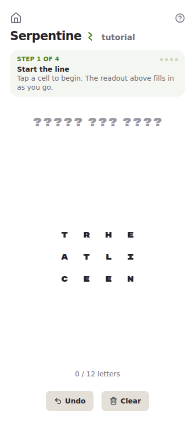
</picture>

**2 · Follow the letters**

<picture>
  <source media="(prefers-color-scheme: dark)" srcset="tutorials/serpentine-2-first-cell-dark.png">
  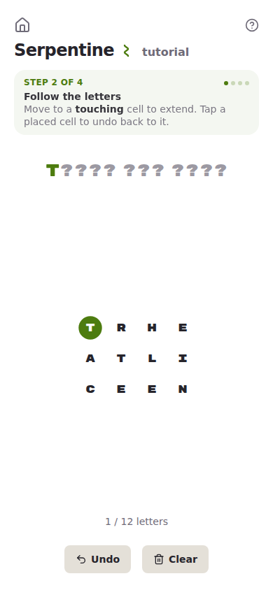
</picture>

**3 · Corners count too**

<picture>
  <source media="(prefers-color-scheme: dark)" srcset="tutorials/serpentine-3-at-the-diagonal-dark.png">
  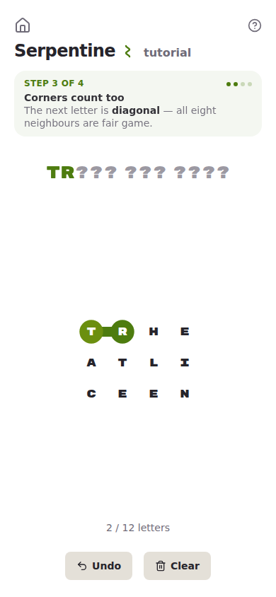
</picture>

**4 · Cover every letter**

<picture>
  <source media="(prefers-color-scheme: dark)" srcset="tutorials/serpentine-4-diagonal-taken-dark.png">
  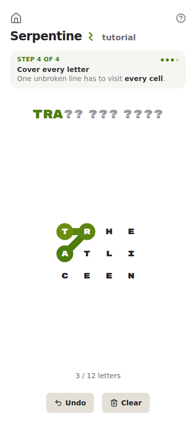
</picture>

**5 · Tutorial complete**

<picture>
  <source media="(prefers-color-scheme: dark)" srcset="tutorials/serpentine-5-complete-dark.png">
  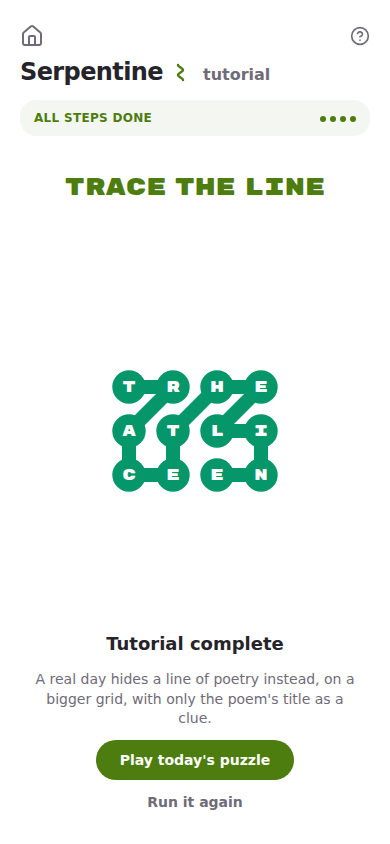
</picture>

---

## How a tutorial is built

Per game: `engine/tutorial.ts` holds the hand-picked puzzle and a pure
`tutorialStepIndex` (no React), `ui/tutorialSteps.tsx` holds the JSX copy, and
`ui/TutorialPage.tsx` mounts the normal `GameScreen` in a fourth `GameMode`
arm, `{ kind: "tutorial" }`. Nothing is locked — a wrong move simply doesn't
advance the step — so no reducer needed input gating.

The puzzles bypass the generators, whose quality bands are tuned for a day's
play and would reject every one of these as too small. Each is instead pinned
by an `engine/tutorial.test.ts` that re-derives it from the real dictionary:
word lists exhaustive, decompositions unique, boards solvable. A dictionary
change can break those tests, but it cannot quietly leave a tutorial teaching
something untrue.

See the Tutorials section of `CLAUDE.md` for the shared kit.
